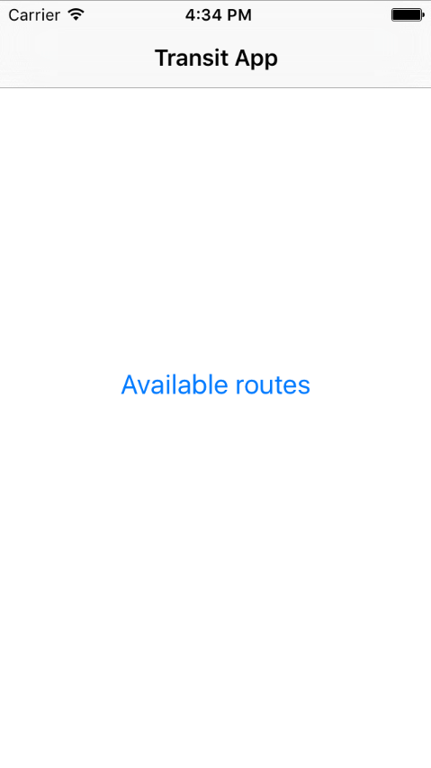
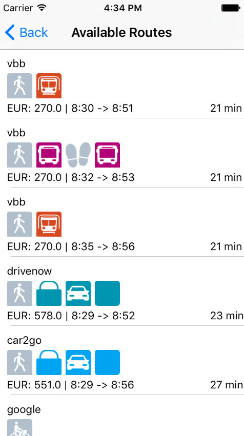
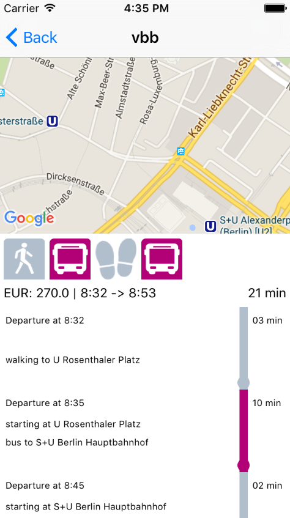
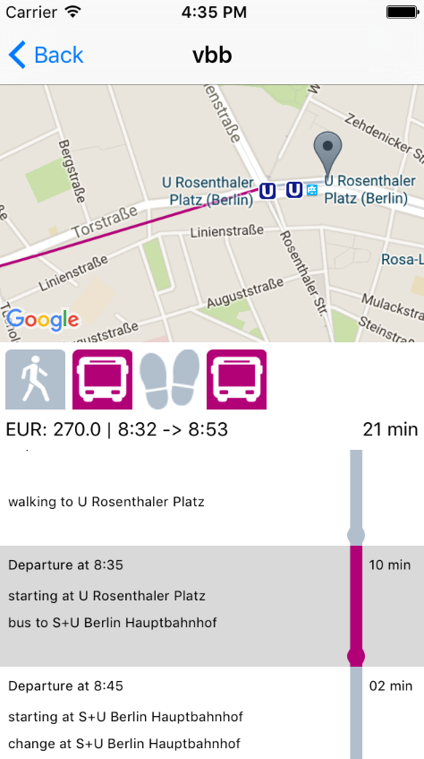

[](https://travis-ci.org/jcfausto/transit-app)

# Transit App

An iOS swift app that shows route information and plots the route on a map. It was used polylines to plot the route's segments on the map and also used SVGKit to deal with the images for each route segment. Those svg's icons images are downloaded, cached and converted into images that are displayed for the user.

# Install

## Prerequisite

- A google maps iOS sdk key. The application already have one in place but it will only work until March 4th 2016. After that you will need to create one. you can get one here: [https://developers.google.com/maps/documentation/ios-sdk/get-api-key](https://developers.google.com/maps/documentation/ios-sdk/get-api-key). The key must be informed at Keys/keys.plist file.
- cocoapods gem installed
  - ```$ sudo gem install cocoapods```

## Get the app
```
$ git clone https://github.com/jcfausto/transit-app.git
$ cd transit-app
```

## Install dependencies

```
$ pod install --project-directory=TransitApp/
```

## Open and test the application
```
$ open TransitApp/TransitApp.xcworkspace/
```

- Press Command + U to run the tests

## Running

- Press Command + R to run the application

# Pods used in this application (dependencies)

- CocoaLumberjack (2.2.0)
- GoogleMaps (1.12.2)
- Nimble (3.0.0)
- Polyline (3.0.0)
- Quick (0.9.1)
- SVGKit (2.x)
- Unbox (1.3.1)

# App images






# License

This is a study project, so feel free to use it.
